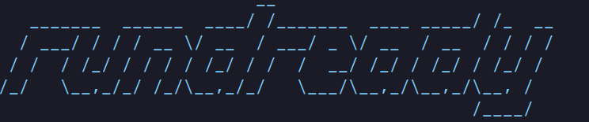

<p align="center">
  
</p>

# runready

[](https://www.npmjs.com/package/@shan8851/runready)
[](https://opensource.org/licenses/MIT)
[](https://nodejs.org)

Check whether a repo is ready to run. Built for developers and agents who would rather not waste half an hour swearing at localhost.

```bash
runready                              # Compact local preflight
runready doctor                       # Full diagnostic view
runready check --only env             # Only check env files/schema/source usage
runready check --only runtime,deps    # Only check Node/package-manager/deps
runready env sync --dry-run           # Preview safe env/example sync changes
runready check --json                 # Machine-readable output
```

`runready` is zero-config by default. It looks for common local setup blockers: Node/package-manager mismatches, missing installs, env drift, duplicate env keys, Docker readiness, script availability, and app port conflicts.

No LLM. No SaaS. No auth. No arbitrary project commands by default.

## Install

```bash
npm install -g @shan8851/runready
```

Or from source:

```bash
git clone https://github.com/shan8851/runready.git
cd runready
pnpm install
pnpm run build
pnpm link --global
```

## Commands

| Command | What it does |
| --- | --- |
| `runready [path]` | Run compact safe preflight checks for the current repo or path |
| `runready check [path]` | Explicit default check command |
| `runready doctor [path]` | Full grouped diagnostic output |
| `runready env sync [path]` | Safely align `.env*` and `.env*.example` files |

## Options

```bash
runready check --only env
runready check --only runtime,deps,scripts
runready check --only docker,ports
runready check --json
runready check --strict
runready check --no-color
runready doctor --only env
```

`--only` accepts comma-separated categories:

- `env`
- `runtime`
- `deps`
- `scripts`
- `docker`
- `ports`

## What it checks

### Project

- Finds the repo/project root
- Detects common project types from files
- Handles being run inside a subdirectory

### Runtime

- Git availability
- Node availability
- Current Node version vs `package.json#engines.node`
- Package-manager availability from `packageManager` or lockfile

### Dependencies

- Lockfile presence
- Multiple-lockfile warnings
- `packageManager` vs lockfile consistency
- `node_modules` / Yarn PnP presence
- Declared dependency links present in `node_modules` where safe to infer

### Environment

- `.env*` and `.env*.example` detection
- Missing local env files
- Missing local keys from examples
- Duplicate env keys
- Empty local values
- Obvious `process.env.*`, `import.meta.env.*`, and T3/Zod schema usage
- Test files and fixtures are ignored by default to avoid noisy false positives

### Docker and ports

- Docker/Compose file detection
- Docker CLI availability
- Docker daemon reachability
- App port conflict checks from env keys like `PORT`, `APP_PORT`, `VITE_PORT`, `NEXT_PORT`
- Compose host-port inference

## Env sync

`runready env sync` helps keep local env files and examples aligned.

```bash
runready env sync --dry-run
runready env sync --yes
```

It can:

- create a missing local env file from an example
- create a missing example file from a local env file with values redacted
- append missing keys to local/example files

Safety rules:

- never overwrites existing keys or values
- never prints secret values
- redacts values when creating examples from local files
- blocks all writes if duplicate/conflicting keys are detected
- previews changes unless `--yes` is passed

## Agent integration

Use `--json` for stable machine-readable output:

```bash
runready check --json
runready check --only env --json
```

Example envelope:

```json
{
  "schemaVersion": 1,
  "ok": false,
  "summary": {
    "fail": 1,
    "pass": 8,
    "skip": 3,
    "warn": 1
  },
  "project": {
    "name": "example-app",
    "root": "/path/to/example-app",
    "type": ["node", "typescript"]
  },
  "checks": [
    {
      "id": "runtime.node.version",
      "category": "runtime",
      "status": "fail",
      "title": "Node version mismatch",
      "expected": ">=20",
      "actual": "18.20.0",
      "suggestion": "nvm install 20 && nvm use 20",
      "nextStep": "nvm install 20 && nvm use 20"
    }
  ],
  "nextSteps": ["nvm install 20 && nvm use 20"]
}
```

Exit codes:

- `0` ready / no failing checks
- `1` one or more checks failed
- `2` invalid CLI usage or unexpected runready error

Warnings do not fail the command unless `--strict` is used.

## Examples

Compact default output:

```bash
$ runready
╭──────────────────────────────────────────────────╮
│   runready ready                                 │
│   Project: @shan8851/runready  /path/to/runready │
│   Summary: 0 fail  0 warn  12 pass  9 skip       │
╰──────────────────────────────────────────────────╯
Project ok  ·  Runtime ok  ·  Dependencies ok  ·  Environment ok  ·  Scripts ok  ·  Docker skip  ·  Ports skip

Notable
✓ Everything notable looks ready.

No next steps needed.
```

Full diagnostic mode:

```bash
runready doctor
```

Env-only check:

```bash
runready check --only env
```

Safe env sync preview:

```bash
runready env sync --dry-run
```

## Development

```bash
pnpm install
pnpm run validate
npm pack --dry-run
```

During development you can run the CLI directly:

```bash
pnpm dev
pnpm dev -- doctor
pnpm dev -- --only env
pnpm dev -- env sync --dry-run
```

## License

MIT
